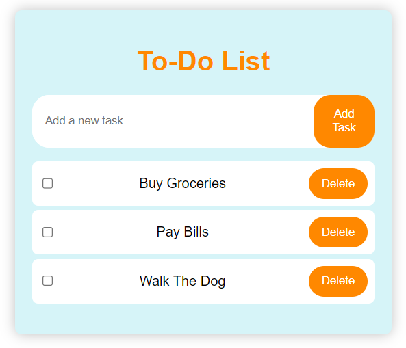
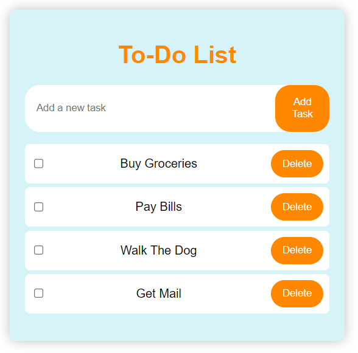
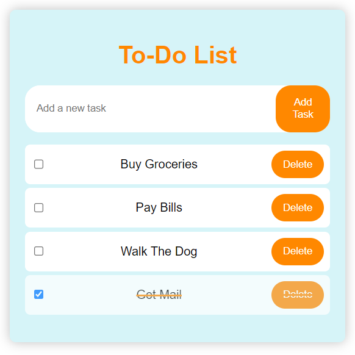

# Todo List

This is a simple todo list application implemented in JavaScript. It allows you to add tasks, delete tasks, and mark tasks as completed.

## Features

- Add a task: Enter a task in the input field and click the "Add" button or press Enter key.
- Delete a task: Click the "Delete" button next to the task.
- Mark a task as completed: Check the checkbox next to the task.

## Getting Started

To run the application, follow these steps:

1. Clone the repository or download the code files.
2. Open the `index.html` file in a web browser.

## Usage

1. Enter a task in the input field.
2. Click the "Add" button or press Enter to add the task to the list.
3. To delete a task, click the "Delete" button next to the task.
4. To mark a task as completed, check the checkbox next to the task.

## Code Overview

The main functionality of the application is implemented in the `index.js` file. Here's an overview of the code structure:

- `addTask`: This function is called when the "Add" button is clicked or the Enter key is pressed. It retrieves the task text from the input field, creates a task item using the `createTaskItem` function, appends the task item to the todo list, and clears the input field.

- `createTaskItem`: This function creates a new task item element with the given task text. It adds a checkbox, task text span, and delete button to the task item, and returns the created element.
- `deleteTask`: This function is called when the "Delete" button is clicked. It removes the corresponding task item from the todo list.
- `toggleTask`: This function is called when a checkbox's state is changed. It toggles the "completed" class on the parent task item, which changes the styling to indicate the task's completion status.

- Event listeners: The application sets up event listeners for the "Add" button, input field (keydown event), and todo list (change event) to handle user interactions.
- Examples of tasks: The application initializes the todo list with some example tasks specified in the `initialTasks` array.